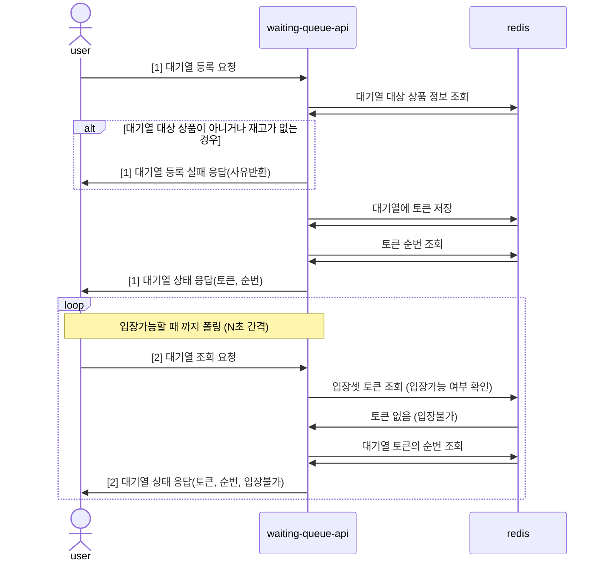
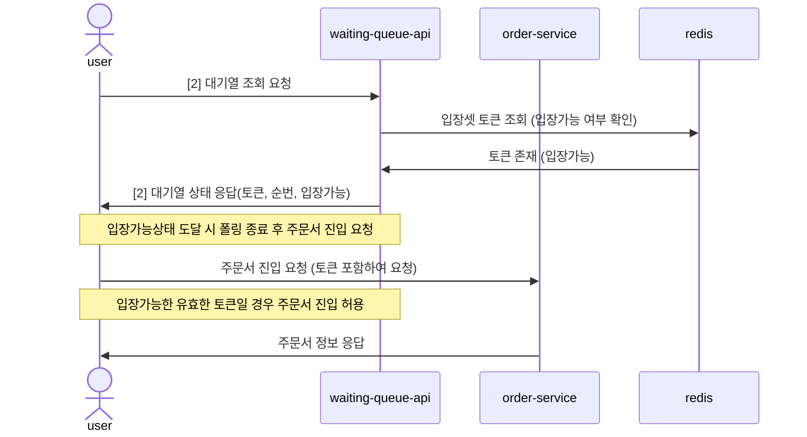
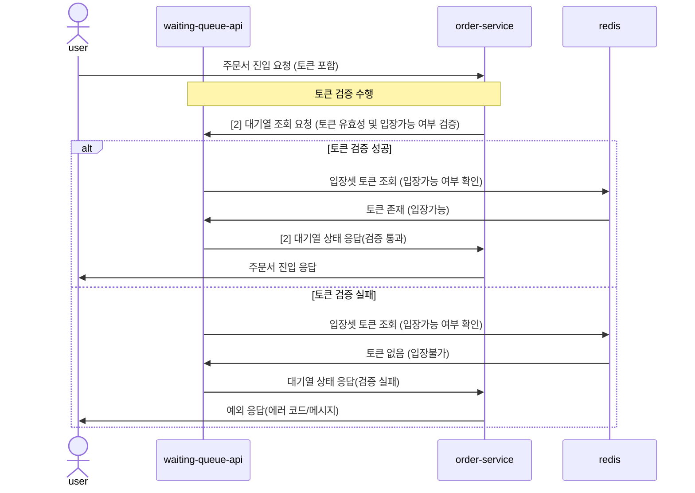
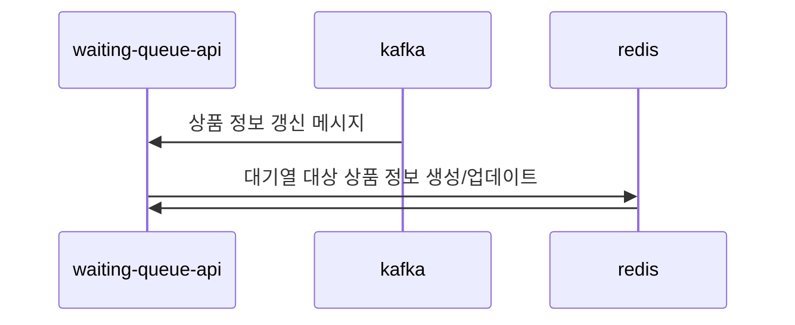
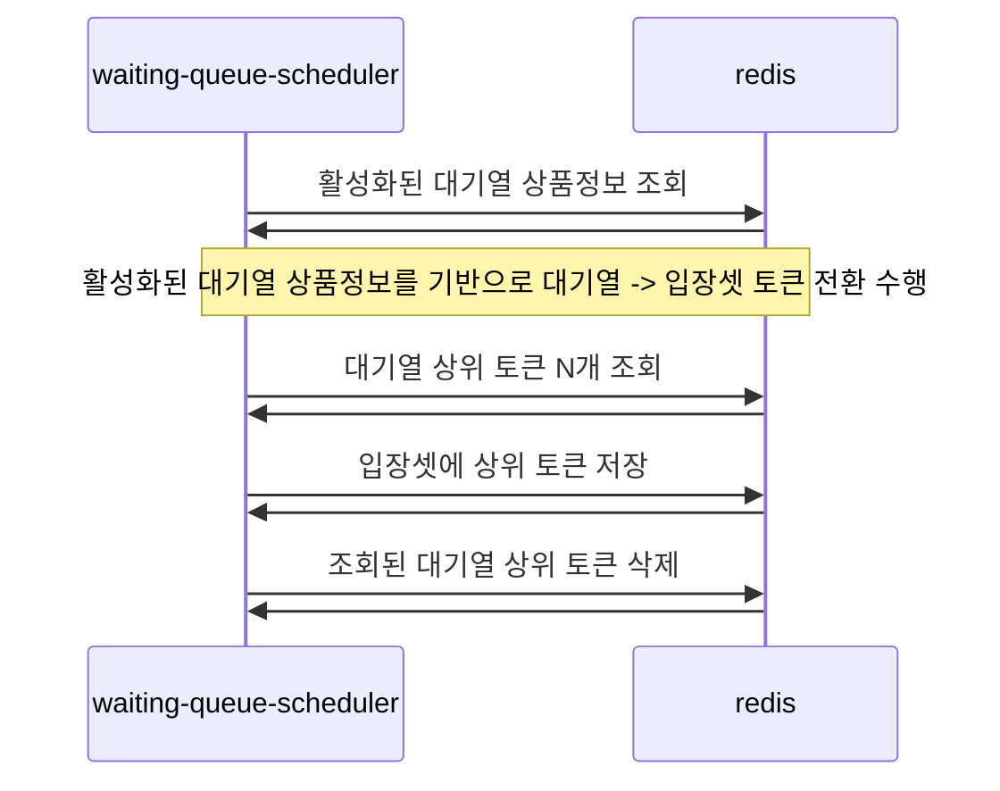

# 대기열 프로젝트
이 프로젝트는 대기열을 관리하는 시스템을 구현합니다.
Grafana K6를 활용하여 준비된 Spike 시나리오를 통해 대기열 등록 및 조회 성능을 테스트할 수 있습니다.

---
## 목차
- [대기열 프로젝트](#대기열-프로젝트)
  - [목적](#목적)
  - [기술 스택 (Tech Stack)](#기술-스택-tech-stack)
  - [개요](#개요)
  - [빠른 실행](#빠른-실행)
    - [전제 조건 (Prerequisites)](#전제-조건-prerequisites)
    - [도커를 통한 Redis 구성](#도커를-통한-redis-구성)
    - [Scheduler 서버와 API 서버 실행](#scheduler-서버와-api-서버-실행)
    - [대기열 테스트 실행](#대기열-테스트-실행)
  - [프로젝트 세부 설명](#프로젝트-세부-설명)
    - [도메인 모델 설명](#도메인-모델-설명)
    - [프로젝트 모듈 설명](#프로젝트-모듈-설명)
    - [구현 시 중점 포인트](#구현-시-중점-포인트)
    - [API 설명](#api-설명)

빠른 실행 및 동작 테스트를 진행하려면 [빠른 실행](#빠른-실행)을,  
프로젝트를 더 깊이 이해하고 싶다면 [개요](#개요)와 [프로젝트 세부 설명](#프로젝트-세부-설명)을 참고하세요.

---

## 목적
이벤트 등으로 인해 갑작스러운 트래픽이 발생할 수 있는 지점에 대기열을 두어 트래픽을 제어하고, 전체 서비스가 안정적으로 동작할 수 있도록 합니다.
이를 위해 대고객 대기열 API와 운용을 위한 어드민 API를 제공합니다.

---

## 기술 스택 (Tech Stack)
- **Language:** Java 21
- **Framework:** Spring Boot, Spring Web
- **Data Store:** Redis
- **Messaging:** Kafka (상품 정보 동기화)
- **Load Testing:** Grafana k6
- **Build Tool:** Gradle 8.7+
- **Virtualization:** Docker

---

## 개요
사용자가 대기열 등록 요청을 하면 토큰을 발행하고 이를 대기열에 저장합니다.
빠른 등록과 조회를 위해 Redis를 활용하며, 토큰은 아래 두 자료구조에 나뉘어 저장됩니다.

- **대기열 (Waiting Queue)**
  - 현재 대기 중인 토큰이 저장되는 공간으로 Redis의 SortedSet(ZSET)을 활용합니다. 
  - score에는 등록 시간을 기록하여 등록 순서대로 순번이 부여됩니다.

- **입장셋 (Entry Set)**
  - 입장 가능한 상태로 전환된 토큰이 저장되는 공간입니다.
  - 단순히 입장 가능 여부만 판단하면 되므로 Redis의 Set을 활용합니다.

사용자가 발급받은 토큰으로 대기열 조회 요청을 하면, 해당 토큰이 대기열에 있는지 입장셋에 있는지에 따라 입장 가능 여부를 판단합니다.  
대기열에서 입장셋으로의 토큰 전환은 전용 스케쥴러를 통해 정기적으로 수행됩니다. 전환 개수는 어드민 API를 통해 실시간 조정이 가능합니다.  
(주기는 변경 후 재기동이 필요하며, 실시간 제어가 필요할 경우 추가 구현이 필요함)  

대기열은 상품별(itemId 기준)로 관리합니다. 클라이언트는 자신이 사용할 상품의 itemId를 키로 활용하면 됩니다.

---

## 빠른 실행
아래 과정으로 프로젝트를 빠르게 실행하고, 간단한 테스트를 진행할 수 있습니다.

### 전제 조건 (권장환경)
- Java 21+
- Gradle 8.7+
- Docker
- k6

### 도커를 통한 Redis 구성
```bash
# redis 이미지 받기
docker image pull redis

# Redis 컨테이너 실행
docker run -d --name wq-redis -p 6379:6379 redis redis-server --requirepass "wq-redis"
```

### Scheduler 서버와 API 서버 실행
- Scheduler 서버는 대기열 상태를 확인하고 다음 단계로 진행합니다.
- API 서버는 대기열 등록 및 조회를 위한 대고객 API를 제공합니다.
- 빠른실행을 위하여 Scheduler 서버를 API 서버보다 먼저 실행해야 합니다.
  - Scheduler 서버 기동 시, 대기열 대상 상품 정보를 초기화하는 로직이 있습니다. (로컬 최초 실행 시, 테스트 상품 Redis에 초기화 WaitingItemInitializer.java 참고)
  - 실제 환경에서는 대기열 상품 정보를 외부(Kafka)에서 전달받을 수 있으므로 기동 순서가 중요하지 않습니다. 
- API 서버는 기동 시 대기열 등록/조회 API에 대한 Warm-up을 수행합니다.

```bash
# Scheduler 서버 기동. 기본 포트는 8081입니다. (반드시 프로젝트 홈경로에서 실행해주세요)
./gradlew :waiting-queue-scheduler:bootRun
# [WaitingItemInitializer] Initialized waiting items: ... 로그가 출력되면 초기화 완료
```

```bash
# API 서버 기동. 기본 포트는 8080입니다. (반드시 프로젝트 홈경로에서 실행해주세요)
./gradlew :waiting-queue-api:bootRun
# ===== E2E Warm-up finished. Application is now fully ready. ===== 로그가 출력되면 준비 완료
```

### 대기열 테스트 실행
Grafana K6를 통해 간단한 수준의 Spike 시나리오 테스트를 진행합니다.
50명의 가상 유저가 초당 20건의 요청을 보내 약 12초 동안 테스트합니다. 터미널에 결과가 출력되면 성공입니다.  

```bash
# k6 설치 (MacOS)
brew install k6

# Spike 시나리오 실행 (두 서버 모두 실행된 상태에서)
k6 run k6scripts/spike-test.js
```
---

## 프로젝트 세부 설명
프로젝트에서 제공하는 API를 설명합니다.
프로젝트의 구조와 설계 그리고 중점 구현사항 등을 추가로 설명합니다.

### 도메인 모델 설명
- **대기열 토큰 (WaitingQueueToken):** 사용자가 대기열에 등록할 때 발급받는 토큰입니다.  
  - 토큰 형태는 `{userId}-{itemId}-{UUID}` 형태로 발급됩니다.
  - 토큰 값만으로 유저·상품 정보를 확인 가능하며, 검증 과정을 통해 토큰 탈취나 어뷰징을 방어합니다.
  
- **대기열 (WaitingQueue):** 
  - 사용자가 대기 중인 상태를 나타내며, 대기열에 등록된 토큰이 순번을 부여받아 대기합니다.
  - Redis SortedSet(ZSET) 활용 
  - 등록 시간 기반으로 순번 관리

- **입장셋 (EntrySet):**
  - 토큰이 입장 가능한 상태로 전환되어 저장되는 공간입니다. 사용자가 대기열에서 입장 가능한 상태가 되면 이곳에 저장됩니다.
  - 입장의 순서는 중요하지 않으므로 Redis의 Set 자료구조를 사용하여 입장 가능한 토큰을 관리합니다.

- **대기열 대상 상품 (WaitingItem):**
  - 대기열이 적용되는 상품을 의미합니다. 대기열 대상 상품의 재고 정보와 대기열 사용 여부 등을 관리합니다.
  - 이를 통해 대기열 불가 상품이 되거나 재고가 없는 상품에 대한 대기열 등록을 방지하여, 불필요한 트래픽 유발을 방지합니다.
  - 상품 서비스에서 발행되는 메시지를 통해 관리됩니다.
  
### 프로젝트 모듈 설명
- **waiting-queue-api**
  - 대고객 대기열 등록·조회 API 제공합니다.
  - Kafka 컨슈머를 통해 대기열 상품 정보(WaitingItem)를 Redis에 반영합니다. 
  - 실제 서비스에서는 대고객 트래픽과 Kafka 트래픽 분리 권장합니다.
  
- **waiting-queue-scheduler:** 
  - 대기열 토큰을 주기적으로 입장셋으로 전환하는 스케쥴러입니다.
  - 단일 서버 동작 권장 (중복 처리 방지)
    - 여러 서버를 구동할 경우 Quartz Cluster나 Redis를 통한 동시성 제어가 필요합니다.
    - 현재 프로젝트에서는 편의상 단일 서버로 구현하였습니다.
  - 이 외에 어드민 API 제공 (토큰 전환 개수 조회/변경, 대기열 모니터링 등)

### 모듈별 구성 방법
- **waiting-queue-api:** N개의 인스턴스로 확장 가능
- **waiting-queue-scheduler:** 단일 서버로 운영 (필요 시 Quartz Cluster/Redis 동시성 제어 고려)
- **[선택] Kafka 컨슈머 분리:** 상품 메시지 트래픽과 API 트래픽 분리

### 구현 시 중점 포인트
**서비스 기동 시 최적의 상태로 동작할 수 있도록 대기열 등록 및 조회 API에 대한 Warm-up을 수행합니다.** 
- `WaitingQueueApiWarmUpInitializer.java` 참고
- 대기열 등록 및 조회 API에 대한 Warm-up을 수행하여, 서비스 기동 시 초기 트래픽에 대한 대응을 준비합니다.
- `WebServerInitializedEvent`를 활용하여 스프링 컨텍스트와 웹서버 초기화가 완료되고 `ApplicationReadyEvent`가 발생하기 전에 Warm-up을 수행합니다.
- 이후, `ApplicationReadyEvent`가 발생하여 `readinessProbe`가 성공적으로 통과되면 그때부터 대고객 트래픽이 유입될 수 있도록 합니다. (SpringActuator를 활용하여 `readinessProbe` 사용)

**활성화된 대기열 정보를 Redis에 저장하여 스케쥴러의 Redis 부하를 줄입니다.**
- `MoveTokenFromWaitingQueueToEntrySetService.java` 참고
- Redis의 `KEYS`나 `SCAN` 명령어를 사용하지 않고 활성화된 대기열을 조회하여 해당 대기열의 토큰을 입장셋으로 옮겨갈 수 있게끔 합니다.
  - `KEYS` 명령어는 블로킹 방식으로 동작하므로 운영 환경에서 사용을 지양합니다.
  - `SCAN` 명령어는 논블로킹이지만, 대기열이 많아질 경우 성능 저하가 발생할 수 있습니다.

**Garafana K6를 활용하여 Spike 시나리오 테스트를 수행합니다.**
- `k6scripts/spike-test.js` 참고
- Spike 시나리오를 통해 대기열 등록 및 조회 API의 성능을 테스트하여 단일 서버의 최대 사용량과 전체 서비스의 인프라 구성을 검토합니다.

**대기열 운용 시 유연하게 대응할 수 있도록 어드민 API를 제공합니다.**
  - `WaitingQueueInternalAdminController.java`, `WaitingItemInternalAdminController.java` 참고
  - 토큰 전환 수를 실시간으로 변경하여 대기열 상황에 따라 유연하게 대응할 수 있습니다.
  - 상품별로 대기열 사용 여부를 수동으로 제어할 수 있습니다.
  - 전체 대기열/입장셋의 토큰 개수를 조회하여 시스템을 모니터링할 수 있습니다.

### API 설명
#### 대기열 등록 및 폴링
**[1] `POST /api/v1/item/{itemId}/waiting-queue`**

사용자가 대기열에 등록을 요청합니다. 대기열 상품 정보를 조회하여 대기열 대상 상품인지 재고가 있는지 확인하여 대기열 등록 여부를 체크합니다.
- **성공 시:** 대기열 토큰과 현재 순번을 반환합니다.
- **실패 시:** 대기열 등록 불가 사유(예: 재고 없음)를 반환합니다.

클라이언트는 발급받은 토큰으로 주기적으로 자신의 상태를 폴링하여 입장 가능 여부를 확인해야 합니다.


<br>  

#### 대기열 상태 확인 및 입장
**[2] `GET /api/v1/item/{itemId}/waiting-queue/{waitingQueueToken}`**

발급받은 토큰으로 대기열 상태를 조회합니다. 토큰이 `입장셋`에 존재하면 '입장 가능' 상태로 판단합니다.
클라이언트는 '입장 가능' 상태가 될 때까지 이 API를 주기적으로 호출하며, '입장 가능' 응답을 받으면 폴링을 멈추고 실제 서비스(예: 주문)로 진입합니다.


<br>

#### 주문서 진입 시 대기열 토큰 검증 과정
주문 서비스는 요청을 처리하기 전에 넘어온 토큰의 유효성을 대기열 시스템에 확인해야 합니다.
이를 통해 최종적으로 입장이 허용된 사용자인지 검증합니다.

- **참고:** 본 프로젝트에서는 편의상 대고객용 조회 API(`GET /api/v1/item/{itemId}/waiting-queue/{waitingQueueToken}`)를 검증에 사용합니다. 실제 운영 환경에서는 서비스 간 통신(Internal API)을 위한 전용 검증 API를 구현하는 것을 권장합니다.


<br>

#### 대기열 상품 정보 갱신 (Kafka 연동)
대기열 대상 상품의 정보(재고, 대기열 사용 여부 등)를 갱신합니다.
외부 시스템(예: 상품 서비스)에서 Kafka를 통해 상품 정보 변경 메시지를 발행하면, `waiting-queue-api`가 이를 구독하여 Redis의 대기열 대상 상품 정보를 최신 상태로 유지합니다.
- **참고:** 현재 프로젝트에는 Kafka 컨슈머 로직만 구현되어 있으며, 실제 Kafka 연동 설정은 생략되어 있습니다.


<br>

#### 대기열 토큰 입장 처리 (스케쥴러)
`waiting-queue-scheduler`가 주기적으로 실행되며, 대기열(Sorted Set)에서 입장 순서가 된 토큰들을 `N`개씩 조회하여 입장셋(Set)으로 이동시킵니다.
- **참고:** 스케쥴러는 단일 서버에서만 동작해야 토큰의 중복 입장을 방지할 수 있습니다. 필수는 아니지만 스케줄러도 여러 인스턴스를 사용하고자 한다면 Quartz Cluster 또는 Redis 분산 락 등을 이용한 동시성 제어가 필요합니다.


<br>

#### 기타 운용을 위한 어드민 기능
운영 중 발생하는 상황에 유연하게 대응할 수 있도록 `waiting-queue-scheduler`를 통해 어드민 API를 제공합니다.
(대고객 트래픽과 분리하여 안정적인 조작을 보장하기 위함)

1.  **스케쥴러가 한번에 옮길 토큰 수 조회**
    - `GET /internal/admin/v1/waiting-queue/token-count-to-move`

2.  **스케쥴러가 한번에 옮길 토큰 수 변경**
    - `PUT /internal/admin/v1/waiting-queue/token-count-to-move`
    - 실시간으로 반영되며, `0`으로 설정 시 입장을 일시 중지할 수 있습니다.

3.  **전체 대기열/입장셋 토큰 개수 조회**
    - `GET /internal/admin/v1/waiting-queue/token-count`
    - 전체 시스템의 대기 현황을 모니터링합니다. (잦은 호출은 Redis 부하 유발 가능하므로 적당한 수준에서 사용)

4.  **대기열 대상 상품 정보 수동 업데이트**
    - `POST /internal/admin/v1/waiting-item/{itemId}/manually`
    - Kafka 연동에 문제가 생기거나 긴급하게 상품 상태를 변경해야 할 때 사용합니다.
